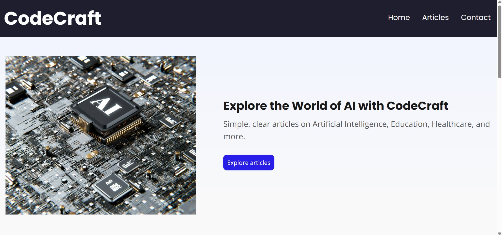
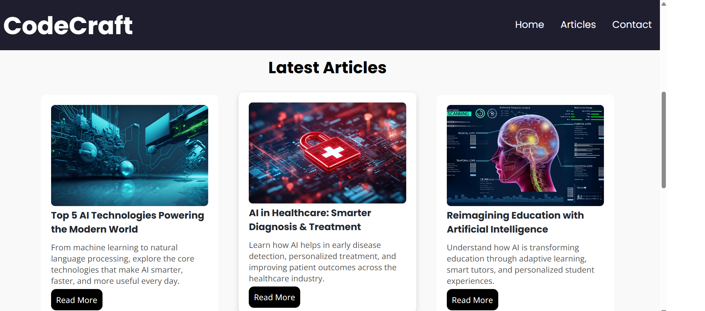
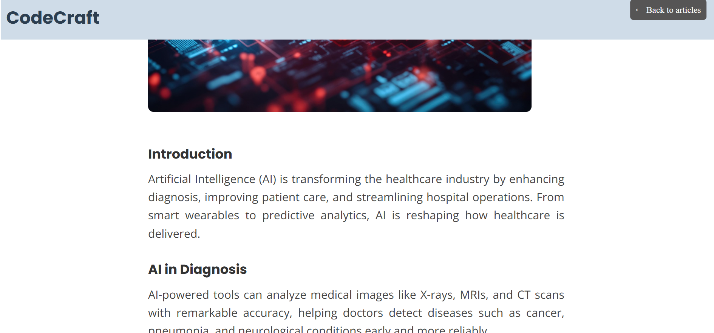
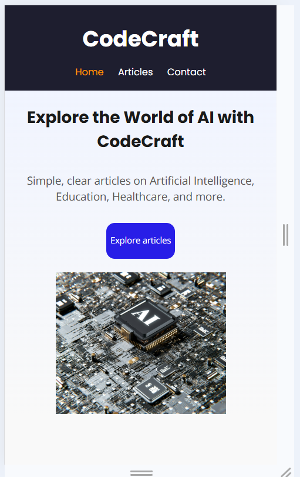

**CodeCraft Blog**

**Project Overview**

**CodeCraft Blog** is a responsive, multi-page website built using HTML5 and CSS3. It focuses on delivering informative articles about artificial intelligence, robotics, healthcare, education, and the future of technology. The project aims to demonstrate clean, accessible, and mobile-friendly web development practices.

**Features**

- Responsive design for all screen sizes (desktop, tablet, mobile)
- Semantic HTML structure and ARIA attributes for accessibility
- Optimized performance using lazy-loaded images
- Consistent styling with a single external CSS file
- SEO-friendly with proper meta tags and content structure

**Technologies Used**

- HTML5
- CSS3
- Google Fonts (Open Sans, Poppins)

**Folder Structure**

↳ index.html            → Main homepage  
↳ style.css             → Main stylesheet  
↳ /images               → Image assets  
↳ /articles             → HTML pages for each article  
↳ /screenshots          → Screenshots used in README  
↳ README.md             → Project documentation  

**How to Use**

1. Clone or download this repository.
2. Open index.html in any modern browser to view the homepage.
3. 3. Use the homepage links to navigate to individual articles.
4. All styles are handled through style.css to ensure consistency.

**What I Learned**

- Creating responsive layouts using media queries
- Writing semantic HTML with ARIA for accessibility
- Structuring multi-page websites with clean navigation
- Using lazy loading to improve performance
- Applying Google Fonts for better typography

**Screenshots**

**Homepage:**

**Articles Page:**

**Single Article Page:**

**Mobile View:**

html

**Live Demo**

[Click here to view the website](https://prethika06.github.io/codecraft-ai-blog/)

